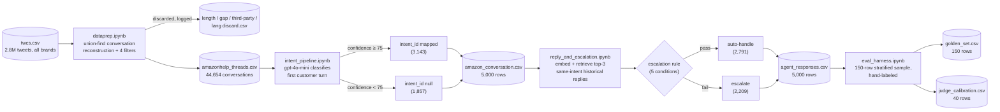

# Architecture

An AI support agent for AmazonHelp: classifies intent, drafts a grounded reply, decides auto-handle vs. escalate. Full numbers: [`pipeline_summary.txt`](pipeline_summary.txt). Setup: [`README.md`](README.md).

## At a glance

Four notebooks, run in sequence, batch-oriented (no live server). Every automated decision — a discard, a null intent, an escalation — carries a stated, machine-readable reason.

| | |
|---|---|
| **Corpus** | 44,654 AmazonHelp conversations, reconstructed from 2.8M raw tweets |
| **Classified** | first 5,000 conversations (oldest by `conv_id`) — a deliberate subsample, not full coverage |
| **Intent accuracy** | 89.3% vs. gold (94.3% confident / 82.3% unconfident — see Limitations) |
| **Escalation agreement** | 70.7% vs. gold (28% over-escalate, 1.3% under-escalate) |
| **Judge–human agreement** | 92.5% within 1 point, but Spearman ρ = 0.11 (not significant) |
| **Models** | `gpt-4o-mini` (classify / draft / judge), `text-embedding-3-small` (retrieval) |

## System diagram

## Pipeline stages

| stage | notebook | method | output |
|---|---|---|---|
| **1. Data prep** | `dataprep.ipynb` | union-find over reply edges reconstructs conversations; 4 cheapest-first filters (length ≤5, gap <24h, 1 customer, English) | `amazonhelp_threads.csv` + 4 discard CSVs |
| **2. Intent classification** | `intent_pipeline.ipynb` | classifies only the customer's *first turn* (the only info available before AmazonHelp replies) into 12 intents; confidence <75 left unmapped rather than guessed | `intent.csv`, `amazon_conversation.csv` |
| **3. Reply + escalation** | `reply_and_escalation.ipynb` | embeds messages, retrieves top-3 same-intent historical AmazonHelp replies as grounding, drafts a new reply; escalation is a 5-condition rule, not a model call | `agent_responses.csv` |
| **4. Evaluation** | `eval_harness.ipynb` | 150-row stratified golden set, hand-labeled; LLM judge scored against 40 human ratings | `golden_set.csv`, `judge_calibration.csv` |

**Escalation rule** (in order — first match wins): (1) intent confidence <75 → unclear · (2) intent = `other` → no resolution path · (3) intent ∈ {`account_access`, `billing_or_payment`} → high-stakes, always escalate · (4) best historical match <0.35 similarity → no grounding · (5) otherwise → auto-handle. A draft is still produced for escalated tickets (except #1/#2) so a human has a starting point.

**Resolution proxy**: the dataset has no outcome/resolution label at all, so "how the brand historically resolved this" = AmazonHelp's own first reply to the most similar past message. Stated explicitly because it's the single biggest approximation in the system.

## Tech stack

| layer | choice | why |
|---|---|---|
| runtime | Python 3.12, Jupyter | notebooks double as documentation |
| data | pandas, numpy | union-find on numpy arrays for speed at 2.8M rows |
| language detection | `langdetect` | free, local; run last (after cheaper filters) |
| LLM | `gpt-4o-mini` | cheapest model sufficient for 12-way classification / short drafting |
| embeddings | `text-embedding-3-small` | cheapest tier; only needs "similar enough," not fine ranking |
| stats | scipy (`spearmanr`) | judge-vs-human correlation |

## Limitations

- 75% confidence threshold is conservative, not precise — the "unconfident" bucket is still 82.3% accurate, so many correct calls are discarded.
- Escalation over-fires (28% over- vs. 1.3% under-escalation), almost entirely from that same confidence gate.
- LLM judge scores don't track human quality ratings (ρ = 0.11) despite a reassuring 92.5% within-1-point figure.
- A few intents misfire on surface keywords (e.g. a thank-you mentioning "account" auto-escalated as `account_access`).
- No "customer already followed up / waited too long" escalation signal exists, though the data supports one.
- Retrieval pool is only 3,143 conversations from the oldest 5,000 — small, non-representative of the full 44,654.
- All hand-labeling to date (golden set, judge calibration, taxonomy) was done by an AI assistant, not an independent human.

## Decision log

Non-obvious calls, and why — a different reasonable engineer could have gone the other way on any of these.

| decision | why |
|---|---|
| Union-find over reply edges, not author-grouping | grouping by author silently splits a thread the moment a third party replies |
| Discard filters run cheapest-first | keeps the 4 discard files mutually exclusive; slow `langdetect` only runs on survivors |
| 24h gap cap, not a looser 7-day window | drops ~3% vs. ~0.6%, but guarantees every kept conversation is same-day |
| Discard multi-customer conversations entirely | once a third party joins, "the customer's problem" isn't well-defined |
| Classify only the first customer turn | later turns are info that doesn't exist yet at the real decision point |
| 75% confidence gate instead of always guessing | traded coverage for precision — unmapped is a visible "don't know" |
| Scoped to first 5,000 (oldest) conversations | pragmatic subsample; explicitly not representative of the corpus |
| Brand's first reply as the "resolution" proxy | no outcome label exists in the data — a named proxy, not a hidden assumption |
| Retrieval restricted to same intent bucket only | stops grounding a reply in a resolution for a different type of problem |
| Escalation is a fixed rule, not an LLM call | auditable, deterministic, always comes with a stated reason |
| `account_access`/`billing_or_payment` always escalate | money/security topics go to a human even at high confidence |
| Escalated tickets still get a draft reply | a human reviewing it still benefits from a starting point |
| Gold escalation policy applied to *gold* intent, not predicted | tests whether the decisions are right, not whether the code agrees with itself |
| Reported the judge's weak correlation, not just the flattering agreement % | both numbers are true; only one alone would have been honest |
| Excluded large regenerable files from the GitHub repo | rebuildable from `dataprep.ipynb`; keeping them would only bloat the repo |

## What's next, prioritized

| priority | action |
|---|---|
| Now | Sweep the 75% confidence threshold against the golden set instead of guessing; add a "customer already followed up" escalation signal |
| Now | Add a precision guard for high-stakes intents so a keyword alone (e.g. "account") can't trigger escalation |
| Next | Scale intent classification from 5,000 to the full 44,654 conversations |
| Next | Grow the golden set toward 250 with genuine human labeling, independent of the system being graded |
| Next | Try a second judge model and per-rubric-dimension scoring; add a second human rater for inter-annotator agreement |
| Later | Draft-then-critique loop + a PII/safety filter pass before a reply is returned |
| Later | Wrap as a live single-message service; monitor escalation-rate and confidence drift over time |
| Later | Capture human-agent edits to escalated drafts as feedback data |
| Later | Support intent changes mid-conversation; test the taxonomy against other brands in the dataset |
