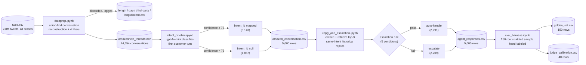

# Architecture

How the AmazonHelp support agent is built, how each piece works, and what's worth doing next. For the raw numbers behind every claim here, see [`pipeline_summary.txt`](pipeline_summary.txt); for setup/reproduction steps, see [`README.md`](README.md).

## 1. Overview

The system takes a single incoming customer tweet directed at AmazonHelp and produces three things: an **intent label**, a **draft reply** grounded in how AmazonHelp has historically responded to similar messages, and an **auto-handle vs. escalate decision** with a stated reason. It is built as four notebooks run in sequence, each reading the previous stage's output and writing its own — there is no shared server process; the pipeline is batch-oriented, not a live API.

```
twcs.csv (raw, 2.8M tweets, all brands)
        │
        ▼
┌───────────────────┐
│  dataprep.ipynb    │  reconstruct conversations, filter to clean AmazonHelp threads
└───────────────────┘
        │
        ▼
amazonhelp_threads.csv (44,654 conversations)
        │
        ▼
┌────────────────────────┐
│ intent_pipeline.ipynb   │  classify first customer turn → 12 intents + confidence
└────────────────────────┘
        │
        ▼
amazon_conversation.csv (5,000 rows, intent-classified)
        │
        ▼
┌──────────────────────────────┐
│ reply_and_escalation.ipynb    │  retrieve similar cases → draft reply → escalation rule
└──────────────────────────────┘
        │
        ▼
agent_responses.csv (5,000 rows: intent + draft + escalate)
        │
        ▼
┌───────────────────┐
│ eval_harness.ipynb │  hand-labeled golden set → accuracy, escalation, judge metrics
└───────────────────┘
        │
        ▼
golden_set.csv, judge_calibration.csv
```

## 2. System diagram



## 3. Components

### 3.1 Data preparation — `dataprep.ipynb`

**Problem it solves**: the raw dataset has no conversation id — just individual tweets with a `in_response_to_tweet_id` pointer. A conversation has to be reconstructed before anything else is possible.

**How it works**:
- **Union-find** over the reply-edge graph (`in_response_to_tweet_id`). Each tweet starts as its own set; every reply edge merges the child's set into its parent's, using path compression so repeated lookups stay cheap even on chains hundreds of tweets deep. Recursive traversal was ruled out specifically because of that depth — it would blow Python's call stack.
- A resulting component is kept only if it contains at least one AmazonHelp tweet.
- Four filters run cheapest-first, so the four discard files never overlap — a conversation lands in exactly one, by whichever filter rejects it first:
  1. **Length** — more than 5 tweets → `length_discard.csv`
  2. **Gap** — any gap between turns ≥ 24 hours → `gap_discard.csv` (a stranger replying to a years-old tweet forms a valid graph edge but not a real conversation; 24h was chosen because 97.1% of real conversations already finish within a day)
  3. **Third party** — more than one non-brand author (or none) → `third_party_discard.csv`
  4. **Language** — customer-side text not detected as English (`langdetect`, after stripping URLs/mentions/hashtags on a throwaway copy) → `lang_discard.csv`
- Every rejected conversation is written out with its full data plus the reason — nothing is dropped silently, so the discard rate at each stage is auditable rather than asserted.

**Output**: `amazonhelp_threads.csv` — one row per tweet, `conv_id` + `turn_index` reconstructed, `is_linear` flagging branching threads.

### 3.2 Intent classification — `intent_pipeline.ipynb`

**Problem it solves**: route an incoming message to the right handling logic.

**How it works**:
- Only the **customer's first turn** per conversation is classified. This isn't an implementation shortcut — a real system has to decide what to do the moment the message arrives, before AmazonHelp has replied, so any later turn is information that doesn't exist yet at decision time.
- Taxonomy: 12 intents (`order_status`, `delivery_problem`, `refund_or_return`, `cancellation_or_change`, `billing_or_payment`, `product_defect`, `account_access`, `app_or_site_technical`, `digital_content`, `subscription_membership`, `general_feedback_or_praise`, `other`), derived by reading a sample of real messages rather than assumed up front. Stored as its own lookup table (`intent.csv`: id, name, definition) so it's a first-class, referenceable schema.
- **Model**: `gpt-4o-mini`, prompted with the full taxonomy + one example per intent, batched ~50 messages per call with a JSON schema response (`{"id", "intent", "confidence"}` per item), run across parallel workers.
- **Confidence gate**: the model self-reports a 0–100 confidence alongside its pick. `intent_id` is populated only at ≥ 75; below that it's left `NULL` rather than guessed, though `predicted_intent`/`confidence` are still recorded for audit. This is a deliberate precision-over-recall choice, not a technical necessity.
- **Scope**: the first 5,000 conversations by `conv_id` — the chronologically *oldest* 5,000 in the corpus, a deliberate subsample per the assignment's guidance, not a claim of full coverage.

**Output**: `amazon_conversation.csv` (`conv_id, text, predicted_intent, confidence, intent_id`).

### 3.3 Reply drafting + escalation — `reply_and_escalation.ipynb`

**Problem it solves**: draft a reply that reflects how this brand actually handles this kind of issue, and decide whether a human needs to see it first.

**How it works**:
- **No outcome label exists anywhere in the raw data** — there's no way to know which historical replies actually resolved a customer's problem. The proxy used: **AmazonHelp's own first reply** to the most similar past message stands in for "how the brand resolved this." This is the single largest approximation in the whole system and is called out explicitly rather than hidden.
- **Retrieval**: `text-embedding-3-small` embeddings of every confidently-classified customer message (the `intent_id`-not-null pool only, so a bad Stage 2 classification can't leak into the grounding pool), cosine similarity computed within the *same intent bucket only* (never across intents), top 3 matches kept per query.
- **Reply drafting**: `gpt-4o-mini`, given the new message plus its top-3 retrieved (past message, AmazonHelp reply) pairs, drafts a new reply in the same resolution style — explicitly instructed not to copy specifics like order numbers from the retrieved examples.
- **Escalation** is a **plain rule, not another model call** — cheap, deterministic, and every decision carries a stated reason, in this priority order:
  1. `intent_id` is null → Stage 2 wasn't confident enough
  2. `predicted_intent == 'other'` → no defined resolution path
  3. `predicted_intent` in `{account_access, billing_or_payment}` → high-stakes, escalate regardless of confidence
  4. no historical match, or best similarity < 0.35 → grounding would be a guess
  5. otherwise → auto-handle
- A draft is still generated for escalated rows whenever grounding exists (skipped only for null-intent/`other`) — a human reviewing an escalated ticket still gets a starting point, it just isn't auto-sent.

**Output**: `agent_responses.csv` (`conv_id, text, predicted_intent, confidence, intent_id, n_grounding_examples, top_similarity, escalate, escalate_reason, draft_reply`).

### 3.4 Evaluation harness — `eval_harness.ipynb`

**Problem it solves**: measure whether any of the above is actually good, rather than assuming it from clean-looking code.

**How it works**:
- **Golden set**: 150 conversations, stratified — up to 12 per `predicted_intent` bucket, topped up to 150 at random — so every intent is represented instead of the sample mirroring the corpus's natural skew toward `delivery_problem`. Fully reproducible: the sampling runs inside the notebook itself against a fixed seed, not from a pre-baked file.
- **Gold labels**: `gold_intent` (the correct intent, independent of what Stage 2 predicted) and `gold_escalate` (whether a human would genuinely need to review it, judged against a *stated policy* applied to the gold intent — not just checked for agreement with the code's own rule, which would be circular).
- **LLM-as-judge**: `gpt-4o-mini` scores a 40-row subset of drafts 1–5 against a four-part rubric (grounded / appropriate / actionable / safe), compared against a human 1–5 rating on the same rows via exact-match rate, within-1-point rate, and Spearman correlation.

**Output**: `golden_set.csv`, `judge_calibration.csv`.

## 4. Tech stack

| layer | choice | why |
|---|---|---|
| language / runtime | Python 3.12, Jupyter notebooks | notebooks double as documentation — every design decision sits next to the code and its actual output |
| data manipulation | pandas, numpy | standard; union-find implemented directly on numpy arrays for speed at 2.8M rows |
| language detection | `langdetect` | cheap, local, no API cost; run only after the three cheaper filters to minimize calls |
| LLM (classification, drafting, judging) | `gpt-4o-mini` via OpenAI API | cheapest model that handles a 12-way classification / short-reply-drafting task well; same model used for every LLM role, so cost stays predictable |
| embeddings (retrieval) | `text-embedding-3-small` via OpenAI API | cheapest embedding tier; retrieval only needs to distinguish "similar enough within an intent," not fine-grained semantic ranking |
| statistics | scipy (`spearmanr`) | judge-vs-human correlation |

## 5. Design principles (recurring across every stage)

- **Every automated decision is logged with a reason, not just a label.** Discards, null intents, and escalations all carry a machine-readable explanation column, not just a boolean.
- **Thresholds are named constants, not buried literals** (`MAX_TWEETS`, `MAX_GAP_HOURS`, `CONFIDENCE_THRESHOLD`, `MIN_SIMILARITY`) — each is called out in the eval harness as unvalidated until checked against the golden set, rather than presented as settled.
- **Escalation logic is a rule, not a model call.** Cheaper, deterministic, and directly auditable — a person can read the five conditions and know exactly why any given message was or wasn't escalated.
- **Classification acts on only the information available at decision time** (first customer turn only) — a recurring discipline against building a system that looks accurate offline by peeking at data a live version wouldn't have.

## 6. Known limitations

(Full detail and numbers in `pipeline_summary.txt` — summarized here.)

- The 75% confidence threshold is conservative rather than precise: accuracy on the "unconfident" bucket (82.3%) isn't much worse than the "confident" bucket (94.3%), meaning many correct classifications are being discarded.
- Escalation over-fires (28% over-escalation vs. 1.3% under-escalation) — safe direction to err in, but a real automation-rate cost, and almost entirely attributable to the same confidence gate.
- The LLM judge's scores don't actually track human-perceived quality (Spearman ρ = 0.11, not significant) despite a reassuring-looking 92.5% within-one-point agreement.
- A handful of intent misclassifications are keyword-driven false positives (e.g., a thank-you message mentioning "account" being tagged `account_access` and auto-escalated) — a precision problem distinct from confidence miscalibration, with no current defense.
- There is no signal for "customer has already followed up / waited too long" — a real escalation trigger that exists in the data but isn't modeled.
- The retrieval and grounding pool is limited to 3,143 conversations among the 5,000 oldest in the corpus — small and non-representative of the full 44,654.
- All hand-labeling to date (golden set, judge calibration, taxonomy derivation) was done by an AI assistant reading messages, not by a human independent of the system being graded.

## 7. Future roadmap

**Fix the measured problems first**
- Sweep the confidence threshold against the golden set to find where accuracy actually drops off, instead of keeping 75 as a guess; consider replacing a single global threshold with per-intent thresholds, since some intents (e.g. `other`) are inherently harder to call confidently than others.
- Add a "repeat contact / elapsed time" escalation signal — some of the golden set's correct escalations were only correct by coincidence of an unrelated intent match, when the real trigger was the customer saying they'd already waited days for a response.
- Add a lightweight precision check for high-stakes intents (e.g., a keyword like "account" shouldn't be sufficient on its own for `account_access`) to cut the false-positive escalations that come from surface-level cues rather than actual content.

**Scale what's already validated**
- Extend Stage 2 classification from the first 5,000 conversations to the full 44,654 — directly improves the Stage 3 retrieval/grounding pool, which is currently small and skewed toward the oldest conversations in the corpus.
- Grow the golden set from 150 toward the assignment's 250 ceiling, with genuine human labeling (not AI-assisted) to get an independent read on where the current numbers hold up.

**Strengthen the eval harness**
- Try a second, different judge model (or a small ensemble) and compare correlation with human ratings — the current 0.11 correlation is weak enough that it's worth checking whether it's `gpt-4o-mini` specifically that's a poor judge, or whether the rubric itself needs to be more structured (e.g., separate 1–5 scores per rubric dimension instead of one holistic score).
- Add inter-annotator agreement on the human side too (a second human rater on the same 40 rows) — right now "human" is a single rater, so the judge is being compared against one person's taste, not a validated ground truth.

**Improve reply quality**
- Move from single-shot drafting to a draft-then-critique loop: have a second model pass check the draft against the rubric before it's returned, catching unsafe promises or ungrounded claims before they reach `agent_responses.csv`.
- Add an explicit PII/safety filter pass — nothing currently checks a draft for account numbers, addresses, or other sensitive content leaking through from the retrieved grounding examples.

**Toward production**
- Wrap the pipeline as a real-time service (single-message endpoint) rather than a batch notebook run, since the whole point of the design (first-turn-only classification, rule-based escalation) is built for a live decision boundary.
- Add monitoring for escalation rate and confidence distribution drift over time — if either shifts significantly from what's in this eval, that's a signal the taxonomy or grounding pool needs revisiting before it's a customer-facing problem.
- Capture human-agent edits to escalated drafts as feedback data — the biggest single lever for improving grounding quality is real correction data, which nothing in the current pipeline collects.

**Broaden scope**
- Generalize past first-turn-only handling to support intent *changes* mid-conversation (a customer whose issue evolves across turns), which the current one-shot design explicitly doesn't handle.
- Extend the same pipeline to other brands in the dataset to test whether the 12-intent taxonomy and escalation policy generalize, or whether they're AmazonHelp-specific.

## 8. Decision log

Non-obvious calls made while building this, and why — a different reasonable engineer could have gone the other way on any of these.

- **Reconstructed conversations with union-find over reply edges, not by grouping tweets from the same author.** Grouping by author would silently split a thread the moment someone else replied into it, and would never reveal that a third party was there at all — the whole third-party filter (below) depends on having the real graph first.
- **Ran the four discard filters cheapest-first (length → gap → third-party → language).** Guarantees the four discard files are mutually exclusive, and means the slow `langdetect` pass only ever runs on conversations that already survived every cheaper check.
- **Capped the conversation-completion gap at 24 hours instead of a looser 7-day window.** Drops roughly 3% of conversations instead of ~0.6%, but guarantees every kept conversation is a same-day exchange rather than one padded out by unrelated stragglers weeks later.
- **Discarded any conversation with more than one customer entirely, rather than trying to attribute the reply to the "right" one.** Once a third party joins, "the customer's problem" stops being a well-defined single thing to classify or resolve — there's no reliable signal for which complaint the AmazonHelp reply was actually answering.
- **Classify intent from the customer's first turn only, never the full thread.** A live system has to decide what to do the moment the message arrives, before AmazonHelp has replied — any later turn is information that doesn't exist yet at the actual decision point, so using it would overstate real-world accuracy.
- **Gated intent mapping on a 75% self-reported confidence threshold instead of always taking the top prediction.** Deliberately traded coverage for precision — an unmapped intent is a visible "don't know," not a wrong guess dressed up as a classification.
- **Scoped Phase 2/3 to the first 5,000 conversations by `conv_id`, i.e. the chronologically *oldest* 5,000, not a random sample.** A pragmatic subsample per the assignment's own guidance, but flagged explicitly because it is not representative of the corpus — a different scoping choice would change every downstream number.
- **Approximated "how the brand historically resolved this" with AmazonHelp's own first reply to the most similar past message.** There is no outcome/resolution label anywhere in the raw data, so this is a named, stated proxy rather than a hidden assumption — the system has no way to know if that historical reply actually worked.
- **Restricted retrieval to the same intent bucket only, even when a cross-intent match might be more textually similar.** Prevents grounding a new reply in a resolution approach for a structurally different problem just because the wording happens to overlap.
- **Made escalation a fixed, auditable rule instead of another LLM call.** Costs a bit of nuance the model might have caught, but buys a decision every line of which a human can read, dispute, and trust to behave the same way twice — and every decision carries a stated reason instead of a black-box score.
- **Escalate `account_access` and `billing_or_payment` unconditionally, regardless of classifier confidence.** A deliberate, conservative policy choice — money and account-security topics go to a human even when the model is very sure, because the cost of being wrong there is asymmetric with every other intent.
- **Still generate a draft reply for escalated conversations (except null-intent and `other`).** A human reviewing a flagged ticket benefits from a starting point even though it won't be auto-sent — escalating a message doesn't mean throwing away the retrieval work already done for it.
- **Evaluated `gold_escalate` against the policy applied to the *gold* intent, not the pipeline's *predicted* intent.** Checking escalation against the model's own predicted intent would just test whether the code correctly implements itself; checking it against the true intent tests whether the actual decisions are right.
- **Reported the LLM judge's weak Spearman correlation (0.11) instead of leading with the flattering 92.5%-within-one-point figure.** Both numbers are true; only one of them would have been honest to present alone, since they largely disagree about how much the judge should be trusted.
- **Excluded large regenerable intermediates from the GitHub repo, keeping only the small final-stage CSVs.** Every dropped file can be rebuilt by rerunning `dataprep.ipynb` against the (separately downloaded) raw dataset, so keeping them in version control would only have bloated the repo without adding anything a grader couldn't reproduce in minutes.
